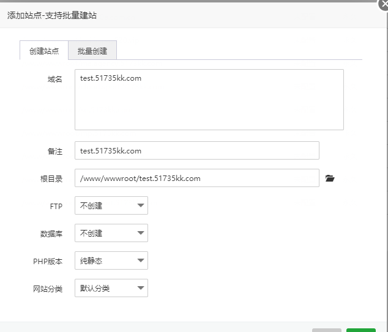
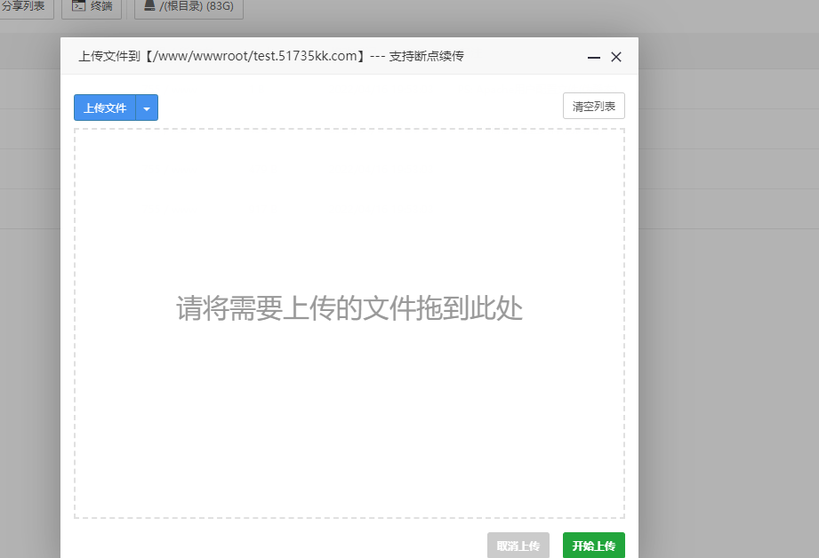

# 运动助手 手动版

#### 介绍
`刷步，刷步数，刷微信步数，刷微信运动步数，刷支付宝能量，种树`

支持QQ运动，微信运动，支付宝运动，钉钉运动。

demo：http://yd.520e.com.cn

#### 软件架构
nginx

vue3.0

打包好的文件在dist文件里面，可直接部署即可

#### 安装教程
安装宝塔

安装nginx

创建网站

上传文件到这个目录

然后访问域名即可

#### 刷步绑定教程
> 小米运动文字教程：https://support.qq.com/products/286658/blog/502241

> 乐心健康文字教程：https://support.qq.com/products/286658/blog/502238

> 悦动圈文字教程：https://support.qq.com/products/286658/blog/501918

